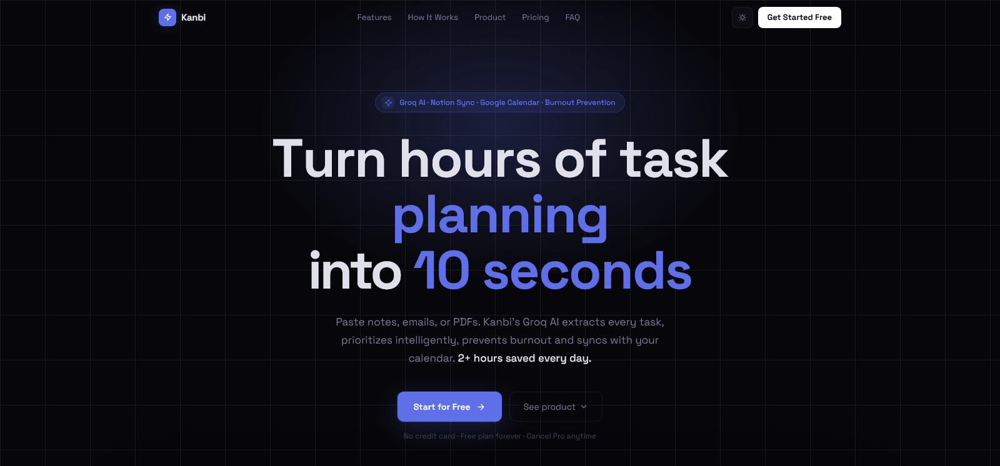

<div align="center">

  

# Kanbi

**AI-powered Kanban board that turns notes, PDFs, and URLs into organized tasks in seconds**

[](https://kanbi.vercel.app)
[](LICENSE)
[](https://typescriptlang.org)
[](https://nextjs.org)
[](https://supabase.com)
[](https://tailwindcss.com)
[](https://stripe.com)

</div>

---

<div align="center">
  
</div>

---

## Overview

Kanbi solves the gap between raw, unstructured notes and an actionable task board. Instead of manually copying tasks from emails, PDFs, or meeting notes, Kanbi uses Groq AI (llama-3.3-70b) to extract, organize, and prioritize them into a Kanban board in under 2 seconds. Built for solo developers, freelancers, and small teams who want a smart productivity layer without the bloat of enterprise tools.

---

## ✨ Features

- 🤖 **AI Task Extraction** — Paste text, upload a PDF, or drop a URL and get a structured Kanban board instantly via Groq AI
- 🧠 **Workload Analysis** — Real-time burnout risk detection, deadline clustering, and workload health scoring
- 💬 **AI Productivity Coach** — Conversational assistant with full board context for planning, prioritization, and advice
- 🚀 **Autopilot Mode** — Morning briefings, auto-scheduling, and intelligent task adjustments based on your workload
- 📅 **Google Calendar Sync** — OAuth 2.0 integration to sync tasks with due dates directly to your calendar
- 📤 **Board Export** — Export any board as a formatted DOCX or PDF file
- 📊 **Analytics Dashboard** — Task stats, activity charts, daily/weekly goal tracking, and AI insight feed
- 🎨 **Board Templates** — Pre-built templates for Daily, Sprint, Meeting, Project, and Quick Start workflows
- 💳 **Stripe Subscriptions** — Free and Premium ($9/mo) tiers with usage limits enforced via RLS
- 🔒 **Row Level Security** — All database tables protected with Supabase RLS policies
- 🌗 **Dark / Light Mode** — System-aware theme with manual toggle
- ⌨️ **Keyboard Shortcuts** — Power-user shortcuts throughout the app
- 📱 **Responsive Design** — Fully usable on mobile, tablet, and desktop

---

## 🛠 Tech Stack

| Category   | Technology                              |
| ---------- | --------------------------------------- |
| Framework  | Next.js (App Router, Turbopack)         |
| Language   | TypeScript 5                            |
| Styling    | Tailwind CSS 3.4 + Radix UI + shadcn/ui |
| Database   | Supabase (PostgreSQL + RLS)             |
| Auth       | Supabase Auth (SSR)                     |
| AI         | Groq SDK (llama-3.3-70b-versatile)      |
| Payments   | Stripe                                  |
| Animation  | Framer Motion                           |
| Charts     | Recharts                                |
| Export     | docx + jspdf                            |
| Validation | Zod                                     |
| Testing    | Vitest + Playwright                     |
| Deployment | Vercel                                  |

---

---

## 🚀 Quick Start

### Prerequisites

- Node.js 18+
- pnpm (`npm install -g pnpm`)
- Supabase account
- Groq API key
- Stripe account (for payments)

### Installation

```bash
# 1. Clone the repo
git clone https://github.com/MuhammadTanveerAbbas/kanbi.git
cd kanbi

# 2. Install dependencies
pnpm install

# 3. Set up environment variables
cp .env.example .env.local
# Fill in your values (see Environment Variables section below)

# 4. Run the development server
pnpm dev

# 5. Open in browser
http://localhost:3000
```

### Database Setup

1. Create a project at [supabase.com](https://supabase.com)
2. Open the SQL Editor and run `supabase/schema.sql`
3. Copy the project URL and keys into `.env.local`

---

## 🔐 Environment Variables

Create a `.env.local` file in the root directory:

```env
# Supabase — Required
NEXT_PUBLIC_SUPABASE_URL=your_supabase_project_url
NEXT_PUBLIC_SUPABASE_ANON_KEY=your_supabase_anon_key
SUPABASE_SERVICE_ROLE_KEY=your_supabase_service_role_key

# Groq AI — Required
GROQ_API_KEY=your_groq_api_key

# Stripe — Required for payments
STRIPE_SECRET_KEY=sk_test_your_stripe_secret_key
NEXT_PUBLIC_STRIPE_PUBLISHABLE_KEY=pk_test_your_stripe_publishable_key
STRIPE_WEBHOOK_SECRET=whsec_your_webhook_secret
STRIPE_PRICE_ID=price_your_price_id

# Google OAuth & Calendar Integration
GOOGLE_CLIENT_ID=your_google_oauth_client_id
GOOGLE_CLIENT_SECRET=your_google_oauth_client_secret

# App
NEXT_PUBLIC_APP_URL=http://localhost:3000
NEXT_PUBLIC_USE_AI=true
```

Get your keys:

- Supabase: https://supabase.com
- Groq: https://console.groq.com/keys
- Stripe: https://dashboard.stripe.com/apikeys
- Google OAuth: https://console.cloud.google.com/apis/credentials

---

## 📁 Project Structure

```
kanbi/
├── public/                  # Static assets
├── src/
│   ├── app/
│   │   ├── (auth)/          # Sign-in, sign-up, forgot, reset-password
│   │   ├── api/
│   │   │   ├── ai/          # Chat, workload analysis, completion tracking
│   │   │   ├── autopilot/   # Morning briefings, schedule, settings
│   │   │   ├── boards/      # Board CRUD and export
│   │   │   ├── extract/     # Text task extraction
│   │   │   ├── parse-pdf/   # PDF task extraction
│   │   │   ├── parse-url/   # URL task extraction
│   │   │   ├── integrations/# Google Calendar OAuth + sync
│   │   │   ├── stripe/      # Checkout and billing portal
│   │   │   └── webhooks/    # Stripe webhook handler
│   │   └── dashboard/       # Board, chat, autopilot, saved, settings pages
│   ├── components/
│   │   ├── ai/              # Task generator component
│   │   ├── auth/            # Auth forms
│   │   ├── board/           # Kanban board UI
│   │   ├── dashboard/       # Dashboard widgets
│   │   ├── landing/         # Landing page sections
│   │   └── ui/              # shadcn/ui primitives
│   ├── hooks/               # useTasksStore, useAuth
│   └── lib/
│       ├── ai/              # WorkloadAnalyzer, ChatAssistant, AutopilotEngine
│       ├── export/          # DOCX and PDF exporters
│       ├── services/        # UsageService, BoardService, CachingService
│       ├── supabase/        # Client, server, and middleware helpers
│       └── validation/      # Zod schemas
├── supabase/
│   └── schema.sql           # Full database schema
├── e2e/                     # Playwright end-to-end tests
├── .env.example             # Environment variable template
└── next.config.ts           # Next.js config with security headers
```

---

## 📦 Available Scripts

| Command              | Description                  |
| -------------------- | ---------------------------- |
| `pnpm dev`           | Start development server     |
| `pnpm build`         | Build for production         |
| `pnpm start`         | Start production server      |
| `pnpm lint`          | Run ESLint                   |
| `pnpm test`          | Run unit tests (single run)  |
| `pnpm test:watch`    | Run unit tests in watch mode |
| `pnpm test:coverage` | Generate coverage report     |
| `pnpm test:e2e`      | Run Playwright E2E tests     |
| `pnpm test:e2e:ui`   | Run Playwright tests with UI |

---

## 💰 Usage Limits

|                        | Free | Premium ($9/mo) |
| ---------------------- | ---- | --------------- |
| AI extractions / day   | 10   | 50              |
| AI extractions / month | 300  | 1,500           |
| Board saves / day      | 10   | 50              |
| Board saves / month    | 300  | 1,500           |
| AI Chat + Autopilot    | ✓    | ✓               |
| PDF import             | ✓    | ✓               |
| DOCX & PDF export      | ✓    | ✓               |
| Google Calendar sync   | ✓    | ✓               |

---

## 🌐 Deployment

This project is deployed on Vercel.

### Deploy Your Own

[](https://vercel.com/new/clone?repository-url=https://github.com/MuhammadTanveerAbbas/kanbi)

1. Click the button above
2. Connect your GitHub account
3. Add all environment variables in the Vercel dashboard
4. Deploy

For production, update:

- `NEXT_PUBLIC_APP_URL` → your domain
- `STRIPE_WEBHOOK_SECRET` → production webhook secret from Stripe dashboard

---

## 🗺 Roadmap

- [x] AI task extraction from text, PDF, and URL
- [x] Drag-and-drop Kanban board
- [x] Workload analysis and burnout detection
- [x] AI productivity coach (chat)
- [x] Autopilot morning briefings
- [x] Google Calendar integration
- [x] Stripe subscriptions
- [x] Board export (DOCX + PDF)
- [x] Analytics dashboard
- [ ] Team / collaboration features
- [ ] Mobile app version
- [ ] Slack and Notion integrations
- [ ] Custom AI model selection

---

## 🤝 Contributing

Contributions are welcome. Feel free to:

1. Fork the repository
2. Create a feature branch (`git checkout -b feature/amazing-feature`)
3. Commit your changes (`git commit -m 'Add amazing feature'`)
4. Push to the branch (`git push origin feature/amazing-feature`)
5. Open a Pull Request

---

## 📄 License

Distributed under the MIT License. See `LICENSE` for more information.

---

## 👨‍💻 Built by The MVP Guy

<div align="center">

**Muhammad Tanveer Abbas**
SaaS Developer | Building production-ready MVPs in 14–21 days

[](https://themvpguy.vercel.app)
[](https://x.com/themvpguy)
[](https://linkedin.com/in/muhammadtanveerabbas)
[](https://github.com/MuhammadTanveerAbbas)

_If this project helped you, please consider giving it a ⭐_

</div>
