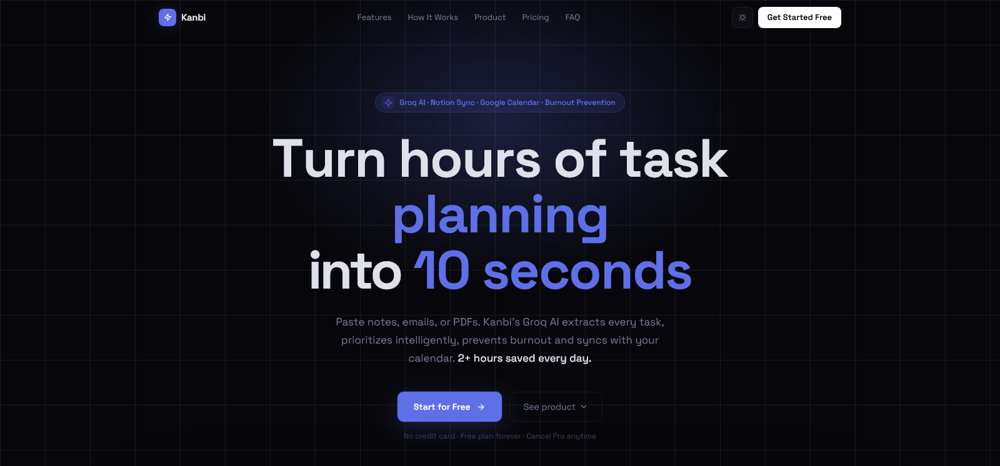

<div align="center">

  

# Kanbi

**AI-powered Kanban board that turns notes, PDFs, and URLs into organized tasks in seconds**

[](https://kanbi.vercel.app)
[](LICENSE)
[](https://typescriptlang.org)
[](https://nextjs.org)
[](https://supabase.com)
[](https://tailwindcss.com)
[](https://stripe.com)

</div>

---

<div align="center">
  
</div>

---

## Overview

Kanbi turns raw, unstructured notes into an actionable task board. Paste text, upload a PDF, or give it a public web page URL, and Kanbi extracts the action items, groups them into a Kanban board, and scores how loaded your week looks.

Two different kinds of logic do the work, and the split is deliberate:

- **Deterministic code** does the arithmetic. The workload health score, the
  burnout risk calculation, deadline clustering, time estimates, and the
  autopilot daily schedule are ordinary TypeScript with no model involved. They
  are unit tested and they always produce the same answer for the same input.
- **A language model** does only what needs language understanding: reading a
  messy note and deciding which sentences are tasks, and answering questions
  about your board in plain language.

This means the product still works, in a degraded but honest way, when the AI
provider is unavailable. Extraction falls back to parsing bullet points, the
chat assistant falls back to a rule-based reply, and every API route returns a
controlled error the interface already knows how to display.

Built for solo developers, freelancers, and small teams.

---

## ✨ Features

- 🤖 **AI Task Extraction** Paste text, upload a PDF, or give a public page URL and get a structured Kanban board
- 🧠 **Workload Analysis** Burnout risk detection, deadline clustering, and a workload health score, all computed deterministically
- 💬 **AI Productivity Coach** Conversational assistant with full board context for planning, prioritization, and advice
- 🚀 **Autopilot Mode** Morning briefings, auto-scheduling, and intelligent task adjustments based on your workload
- 📤 **Board Export** Export any saved board as DOCX or PDF, grouped by column, from the Saved Boards page or Settings
- 📊 **Analytics Dashboard** Task stats, activity charts, and daily/weekly goal tracking
- 🎨 **Board Templates** Pre-built templates for Daily, Sprint, Meeting, Project, and Quick Start workflows
- 💳 **Stripe Subscriptions** Free and Premium ($9/mo) tiers with usage limits enforced via RLS
- 🔒 **Row Level Security** All database tables protected with Supabase RLS policies
- 🌗 **Dark / Light Mode** System-aware theme with manual toggle
- ⌨️ **Keyboard Shortcuts** Power-user shortcuts throughout the app
- 📱 **Responsive Design** Fully usable on mobile, tablet, and desktop

---

## 🛠 Tech Stack

| Category   | Technology                              |
| ---------- | --------------------------------------- |
| Framework  | Next.js (App Router, Turbopack)         |
| Language   | TypeScript 5                            |
| Styling    | Tailwind CSS 3.4 + Radix UI + shadcn/ui |
| Database   | Supabase (PostgreSQL + RLS)             |
| Auth       | Supabase Auth (SSR)                     |
| AI         | Groq SDK, model chosen from the live catalog |
| Payments   | Stripe                                  |
| Animation  | Framer Motion                           |
| Charts     | Recharts                                |
| Export     | docx + jspdf                            |
| Validation | Zod                                     |
| Testing    | Vitest + Playwright                     |
| Deployment | Vercel                                  |

---

---

## 🚀 Quick Start

### Prerequisites

- Node.js 18+
- pnpm (`npm install -g pnpm`)
- Supabase account
- Groq API key
- Stripe account (for payments)

### Installation

```bash
# 1. Clone the repo
git clone https://github.com/MuhammadTanveerAbbas/kanbi.git
cd kanbi

# 2. Install dependencies
pnpm install

# 3. Set up environment variables
cp .env.example .env.local
# Fill in your values (see Environment Variables section below)

# 4. Run the development server
pnpm dev

# 5. Open in browser
http://localhost:3000
```

### Database Setup

1. Create a project at [supabase.com](https://supabase.com)
2. Open the SQL Editor and run `supabase/schema.sql`
3. Copy the project URL and keys into `.env.local`

---

## 🔐 Environment Variables

Create a `.env.local` file in the root directory:

```env
# Supabase  Required
NEXT_PUBLIC_SUPABASE_URL=your_supabase_project_url
NEXT_PUBLIC_SUPABASE_ANON_KEY=your_supabase_anon_key
SUPABASE_SERVICE_ROLE_KEY=your_supabase_service_role_key

# Groq AI  Required
GROQ_API_KEY=your_groq_api_key

# Last-resort Groq model (optional, defaults to llama-3.3-70b-versatile).
# Normally the model is chosen from Groq's live catalog based on what each
# request needs. Set this only to pin a specific model.
GROQ_MODEL=llama-3.3-70b-versatile

# Stripe  Required for payments
STRIPE_SECRET_KEY=sk_test_your_stripe_secret_key
NEXT_PUBLIC_STRIPE_PUBLISHABLE_KEY=pk_test_your_stripe_publishable_key
STRIPE_WEBHOOK_SECRET=whsec_your_webhook_secret
STRIPE_PRICE_ID=price_your_price_id

# App
NEXT_PUBLIC_APP_URL=http://localhost:3000
```

Get your keys:

- Supabase: https://supabase.com
- Groq: https://console.groq.com/keys
- Stripe: https://dashboard.stripe.com/apikeys

---

## 📁 Project Structure

```
kanbi/
├── public/                       Static assets
├── src/
│   ├── app/
│   │   ├── (auth)/               Sign-in, sign-up, forgot, reset-password
│   │   ├── auth/callback/        OAuth callback
│   │   ├── dashboard/            The dashboard, one client component per page
│   │   │   └── __tests__/        Fitness checks on dashboard source
│   │   ├── changelog/         Public changelog page
│   │   ├── pricing/ privacy/ terms/
│   │   └── api/
│   │       ├── ai/               Chat, workload analysis, completion tracking
│   │       ├── autopilot/        Daily briefing and schedule
│   │       ├── boards/           Task CRUD, board save, DOCX and PDF export
│   │       ├── saved/            Saved board list, rename, delete
│   │       ├── cron/             Scheduled cleanup
│   │       ├── extract/          Text task extraction
│   │       ├── parse-pdf/        PDF task extraction
│   │       ├── parse-url/        Web page task extraction
│   │       ├── profile/ usage/ task-activity/ sync-task-stats/
│   │       ├── health/ keep-alive/
│   │       ├── stripe/           Checkout and billing portal
│   │       └── webhooks/stripe/  Subscription lifecycle
│   ├── components/
│   │   ├── ChangelogPage.tsx     Changelog page component
│   │   ├── auth/                 Auth forms and layout
│   │   ├── dashboard/            Charts, icons, UI atoms, types, export hook
│   │   └── ui/                   shadcn/ui primitives
│   ├── proxy.ts                  Auth, session, CSRF, security headers
│   └── lib/
│       ├── ai/
│       │   ├── groq-client.ts        Provider boundary, retries, timeouts
│       │   ├── model-selector.ts     Catalog-driven model choice
│       │   ├── workload-analyzer.ts  Health score, burnout, clusters
│       │   ├── chat-assistant.ts     Board-aware chat
│       │   └── autopilot-engine.ts   Scheduling and briefings
│       ├── workload/health-score.ts  Board health score used by the UI
│       ├── outbound-url.ts           SSRF-safe outbound fetch
│       ├── security.ts               CSRF origin check, input sanitising
│       ├── validation/schemas.ts     Zod request schemas
│       ├── export/                   DOCX and PDF exporters
│       ├── services/                 UsageService, default board helper
│       ├── supabase/                 Client, server, and admin helpers
│       ├── cache/ logging/ errors/   Cache manager, structured logger, AppError
│       ├── changelog-data.ts         Changelog content for the page
│       ├── constants.ts              Shared vocabularies and limits
│       ├── types.ts                  Domain types
│       └── api/helpers.ts            Current-user helper
├── supabase/schema.sql          Database schema, 19 tables, 56 RLS policies
├── e2e/                        Playwright end-to-end tests
├── __tests__/                  Vitest unit and integration tests
├── .github/workflows/ci.yml    Lint, type check, test, build
├── CHANGELOG.md                Version history reconstructed from Git
├── .env.example                Environment variable template
└── next.config.ts              Next.js config with security headers
```

---

## 📦 Available Scripts

| Command                   | Description                                     |
| ------------------------- | ----------------------------------------------- |
| `pnpm dev`                | Start the development server                    |
| `pnpm build`              | Build for production                            |
| `pnpm start`              | Start the production server                     |
| `pnpm lint`               | Run ESLint over the repository                  |
| `pnpm lint:fix`           | Apply ESLint autofixes                         |
| `pnpm typecheck`          | Regenerate route types, then run `tsc --noEmit` |
| `pnpm test`               | Run unit and integration tests once             |
| `pnpm test:watch`         | Run tests in watch mode                        |
| `pnpm test:coverage`      | Generate a coverage report                     |
| `pnpm test:e2e`           | Run Playwright end-to-end tests                |
| `pnpm test:e2e:ui`        | Run Playwright tests with the UI reporter       |
| `pnpm verify:lockfile`    | Verify the lockfile matches `package.json`      |

All of these run in CI on every push and pull request to `main`.

---

## Reliability

Kanbi keeps a small server-side reliability layer around the AI provider so a
provider problem degrades the product instead of breaking it.

### Model selection

Kanbi does not hardcode a belief about which model is best. On each request it
reads Groq's live model catalog, which is cached for one hour, and picks a model
that can actually satisfy that request:

- Models Groq has retired are excluded by id, so a stale cached catalog cannot
  cause a dead model to be selected.
- Audio and moderation models are excluded, since they cannot serve a chat
  completion.
- Each candidate's reported `max_completion_tokens` and `context_window` are
  checked against what the request needs. A model that cannot produce the
  requested output length is rejected.
- Among the models that qualify, a declared preference order applies, then more
  headroom wins, then alphabetical order so the result is deterministic.
- If the catalog cannot be fetched, or nothing in it qualifies, `GROQ_MODEL` is
  used so the request is still attempted. If that is rejected too, the request
  fails with a controlled error rather than looping.
- If the chosen model is rejected at request time, the catalog is refreshed and
  one alternative is tried.

### Retries

- HTTP 429 respects `Retry-After` when present, otherwise exponential backoff
  with jitter. At most 3 retries.
- Timeouts, 5xx, and network errors retry at most 2 times.
- Non-retryable errors, such as an invalid API key, are not retried at all.
- Retries are bounded, so a failing provider cannot cause an unbounded wait.

### Degradation

A provider failure never crashes the app. Extraction falls back to parsing bullet
points, the chat assistant falls back to a rule-based reply, and every route
returns a controlled error the interface already handles. `GET /api/health`
reports Supabase connectivity through a read-only query.

---

## 💰 Usage Limits

These are the values in `src/lib/constants.ts`, which is the single source of
truth enforced at request time.

|                        | Free | Premium ($9/mo) |
| ---------------------- | ---- | --------------- |
| AI requests / day      | 10   | 100             |
| AI requests / month    | 300  | 1,500           |
| Board saves / day      | 10   | 100             |
| Board saves / month    | 300  | 1,500           |
| AI Chat + Autopilot    | Yes  | Yes             |
| Text, PDF, URL import  | Yes  | Yes             |
| DOCX & PDF export      | Yes  | Yes             |

Rate limits are also applied per IP on every mutating route, using Upstash Redis
when `UPSTASH_REDIS_REST_URL` and `UPSTASH_REDIS_REST_TOKEN` are set, and an
in-process counter otherwise. The in-process counter is per server instance, so
on a multi-instance deployment it is weaker than the Redis path.

---

## 🌐 Deployment

This project is deployed on Vercel.

### Deploy Your Own

[](https://vercel.com/new/clone?repository-url=https://github.com/MuhammadTanveerAbbas/kanbi)

1. Click the button above
2. Connect your GitHub account
3. Add all environment variables in the Vercel dashboard
4. Deploy

For production, update:

- `NEXT_PUBLIC_APP_URL` ➜ your domain
- `STRIPE_WEBHOOK_SECRET` ➜ production webhook secret from Stripe dashboard

---

## 📋 Changelog

Two views of the same history, kept deliberately separate:

| | Audience | File or route |
| --- | --- | --- |
| **Changelog page** | Users of the product | `/changelog` in the running app, linked from the site footer |
| **Project changelog** | Developers and contributors | [`CHANGELOG.md`](./CHANGELOG.md) in the repository |

The page lists every user visible change, newest first, with filters for added,
fixed, security, changed, and removed. Its content lives in
`src/lib/changelog-data.ts`, so the rendered page and the file cannot drift apart.

The repository changelog carries more: the engineering rationale for each
change, the measurement methodology behind the historical graphs, and an explicit
statement of what could not be determined from the repository.

Versions before `3.2.0` have no release notes in the repository. The page says
so on those entries rather than inventing detail, and their dates come from the
`version` field in `package.json` at each commit.

---

## 🗺 Roadmap

Working today:

- [x] AI task extraction from text, PDF, and public page URL
- [x] Kanban board with drag-and-drop columns
- [x] Workload health score and burnout risk detection
- [x] AI productivity coach (chat), with a rule-based fallback
- [x] Autopilot daily schedule and morning briefings
- [x] Stripe subscriptions
- [x] Board export to DOCX and PDF
- [x] Analytics dashboard
- [x] Dynamic AI model selection from the live provider catalog

Not built:

- [ ] Team or collaboration features
- [ ] Native mobile app
- [ ] Slack, Notion, or calendar integrations
- [ ] Per-user AI model preference

## Known limitations

Stated plainly, because a product that hides its edges is harder to rely on.

- **The board health score is a heuristic, not a measurement.** It scores 0 to
  100 from the proportion of high and urgent tasks on the board. It does not
  use your calendar, your actual completion times, or your real working hours.
- **A more detailed capacity model exists but is not wired into the interface.**
  `WorkloadAnalyzer` in `src/lib/ai/workload-analyzer.ts` estimates hours against
  a daily capacity, adds a context-switching cost, and factors in consecutive
  overloaded days. The endpoint `/api/ai/analyze-workload` exposes it, but the
  dashboard currently uses the simpler client-side score instead. These are two
  different numbers and are not interchangeable.
- **AI output quality is not benchmarked.** Extraction quality depends on the
  model and the input. No evaluation dataset is run in CI, so no claim is made
  about accuracy.
- **Extraction speed is not measured.** No latency benchmark is published
  because none has been run in a reproducible environment.
- **Single tenant per account.** There are no teams, shared boards, or roles.
- **Usage limits are enforced in application code, not in the database.** The
  limits are read from constants, so changing them requires a deploy.
- **The autopilot schedule is generated by code, not by a model.** It is a
  deterministic priority sort with fixed duration estimates, not a plan that
  reasons about your calendar.
- **Rate limiting without Redis is per instance.** See the usage limits section.

---

## 🤝 Contributing

Contributions are welcome. Feel free to:

1. Fork the repository
2. Create a feature branch (`git checkout -b feature/amazing-feature`)
3. Commit your changes (`git commit -m 'Add amazing feature'`)
4. Push to the branch (`git push origin feature/amazing-feature`)
5. Open a Pull Request

---

## 📄 License

Distributed under the MIT License. See `LICENSE` for more information.

---

## 👨‍💻 Built by The MVP Guy

<div align="center">

**Muhammad Tanveer Abbas**
SaaS Developer | Building production-ready MVPs in 14–21 days

[](https://themvpguy.vercel.app)
[](https://x.com/themvpguy)
[](https://linkedin.com/in/muhammadtanveerabbas)
[](https://github.com/MuhammadTanveerAbbas)

_If this project helped you, please consider giving it a ⭐_

</div>
